# 👁️ AIthentic: Military-Grade Neural Forensics

<div align="center">


<p align="center">
  <strong>Detecting the invisible heartbeat of Synthetic Media.</strong>
</p>


<p><em>Watch the Neural Terminal analyze a deepfake in real-time.</em></p>

</div>

---

## 🕵️‍♂️ Why This Tool Exists
> **"Seeing is no longer believing."**

In 2024 alone, deepfake fraud cost companies over **$25 Billion**. From fake CEO calls to political disinformation, synthetic media is the new cybersecurity threat.

Existing tools are too slow (analyzing every frame) or too dumb (looking at static pixels). **AIthentic** was built to catch the one thing AI generators can't hide yet: **The Glitch in Time.**

---

## 💡 The "Bouncer" Analogy (How it works simply)
Imagine a nightclub bouncer checking IDs.
* **Traditional Detectors** just glance at the ID photo. If it looks real, you get in. (Deepfakes pass this easily because they generate perfect static images).
* **AIthentic** doesn't just look at the photo. We ask you to **blink, talk, and turn your head.** We watch the *video* of your movements. If your lips jitter unnaturally or your blinking looks robotic, we know it's a fake.

---

## 🔬 Scientific Foundation & Architecture

Our architecture is a hybrid implementation derived from state-of-the-art forensic research.

### 1. ⚡ Active Entropy Sampling (AES)
* **The Logic:** 90% of a video frame is useless background. Processing it is a waste of GPU.
* **The Fix:** We calculate the **Pixel-Difference Entropy** for the entire video stream.
* **The Result:** The system ignores static noise and surgically extracts the **Top 20 High-Motion Frames** (e.g., mid-blink, lip purse)—the exact moments where Deepfakes glitch.

### 2. 👁️ Spatial Feature Extraction (EfficientNet-B3)
* **Research Reference:** Inspired by *Li et al. (CVPRW 2019)*.
* **Theory:** Deepfakes rely on affine warping to fit a face onto a head. This leaves microscopic artifacts at the blending boundaries.
* **Implementation:** We use a pre-trained **EfficientNet-B3** to extract a 1536-dimensional feature vector encoding these subtle texture anomalies.

### 3. 🧠 Temporal Sequence Modeling (Bi-LSTM)
* **Research Reference:** Inspired by *Liu et al. (WACV 2023)*.
* **Theory:** Fake videos suffer from "Temporal Identity Inconsistency"—the face in Frame 1 is mathematically slightly different from Frame 2.
* **Implementation:** A **Bidirectional LSTM** analyzes the vector sequence *forwards and backwards*, catching **Temporal Jitter** (micro-flickering) caused by generator incoherence.

---

## 📊 Performance Benchmarks (Verified)

Rigorously trained and evaluated on the **FaceForensics++ (c23) and celeb-** dataset.

| Metric | Result | Source |
| :--- | :--- | :--- |
| **Test Accuracy** | **96.71%** | `FINAL-MODEL-TEST.pdf` |
| **Training Acc** | **99.42%** | `FINAL-MODEL-TRAIN.pdf` |
| **Precision (Fake)**| **0.99** | Minimal False Positives |
| **Inference Time** | **~2.5s** | Average per video |

---

## 📡 Forensic Pipeline

```mermaid
graph TD
    A[📹 Input Stream] -->|Entropy Algorithm| B(⚡ Active Sampling)
    B -->|Filter Best 20 Frames| C{MTCNN Face Detect}
    C -->|Aligned Faces| D[👁️ EfficientNet-B3]
    D -->|1536-dim Vectors| E[🧠 Bi-Directional LSTM]
    E -->|Temporal Analysis| F[🛡️ CONFIDENCE SCORE]
    
    F -->|Score < 0.5| G[✅ REAL FOOTAGE]
    F -->|Score > 0.5| H[⚠️ DEEPFAKE DETECTED]
    
    style A fill:#00ff41,stroke:#333,stroke-width:2px,color:#000
    style H fill:#ff003c,stroke:#333,stroke-width:2px,color:#fff
    style G fill:#00ff41,stroke:#333,stroke-width:2px,color:#000
```



## 🤖 Tech Stack

* **Frontend:** Streamlit, Custom CSS (Cyberpunk Theme)
* **Deep Learning:** PyTorch, Torchvision
* **Computer Vision:** OpenCV (cv2), MTCNN (Face Detection)
* **Data Processing:** NumPy, Pandas, PIL
* **GenAI:** Google Generative AI (Gemini)

---

## 🤝 Contributing

We welcome contributions to improve the forensic accuracy of AIthentic!

1.  **Fork the repository** to your GitHub account.
2.  **Create a new branch** for your feature:
    ```bash
    git checkout -b feature-branch
    ```
3.  **Commit your changes** with descriptive messages:
    ```bash
    git commit -m "Added new entropy algorithm"
    ```
4.  **Push to the branch**:
    ```bash
    git push origin feature-branch
    ```
5.  **Open a Pull Request** and describe your changes.

---

<div align="center">
  Made with ❤️ by <strong>Team CodePagloos</strong>
</div>
